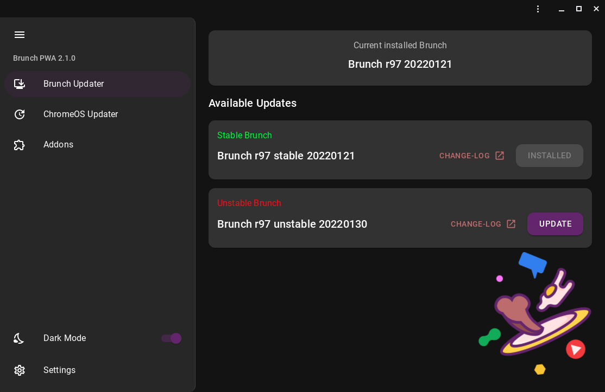

<!-- Shields/Logos -->

[![License][license-shield]][license-url]
[![Issues][issues-shield]][issues-url]
[![Discord][discord-shield]][discord-url]
[![Reddit][reddit-shield]][reddit-url]
[![Telegram][telegram-shield]][telegram-url]

<!-- Project Logo -->

  

<h1 align="center">Brunch PWA Version 2</h1>

## Overview

An application to easily update brunch and install add-ons on ChromeOS. now with sexier Ui ;)

   

## Special Thanks

First of all, thanks goes to [Brunch Framework Project][brunch-frame], [Sebanc](https://github.com/sebanc) and Team for their work which was the main cause this project exists in the first place.

## Install Instructions

Enable the "pwa" brunch option (cf "Framework options" section from the main brunch github readme).

Open https://itesaurabh.github.io/brunch-pwa in your browser and install the PWA.

learn more at [brunch-pwa-info]
## Troubleshooting and Support

In case you run into issues while installing or using Brunch, below are the main places where you can find support:

[Discord][discord-url]
[Reddit][reddit-url]
[Telegram][telegram-url]

[brunch-frame]: https://github.com/sebanc/brunch
[license-shield]: https://img.shields.io/github/license/ITESaurabh/brunch-pwa?label=License&logo=Github&style=flat-square
[license-url]: ./LICENSE
[issues-shield]: https://img.shields.io/github/issues/ITESaurabh/brunch-pwa?label=Issues&logo=Github&style=flat-square
[issues-url]: https://github.com/ITESaurabh/brunch-pwa/issues
[discord-shield]: https://img.shields.io/badge/Discord-Join-7289da?style=flat-square&logo=discord&logoColor=%23FFFFFF
[discord-url]: https://discord.gg/x2EgK2M
[telegram-shield]: https://img.shields.io/badge/Telegram-Join-0088cc?style=flat-square&logo=telegram&logoColor=%23FFFFFF
[telegram-url]: https://t.me/chromeosforpc
[reddit-shield]: https://img.shields.io/badge/Reddit-Join-FF5700?style=flat-square&logo=reddit&logoColor=%23FFFFFF
[reddit-url]: https://www.reddit.com/r/Brunchbook
[brunch-pwa-info]: https://github.com/sebanc/brunch/wiki/Brunch-PWA-Guide

